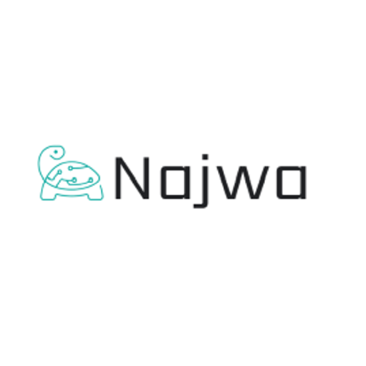

<br>
<hr style="height:4px;border-width:10;color:blue;background-color:black">



# PROJECT TITLE
<hr style="height:4px;border-width:10;color:blue;background-color:black">

<br><br><br><br>


## Background:
<hr style="height:1.5px;border-width:10;color:blue;background-color:black">

We are a small startup focusing mainly on providing machine learning solutions in the European banking market. We work on a variety of problems including fraud detection, sentiment classification and customer intention prediction and classification.
<br><br>


## Data Description:
<hr style="height:1.5px;border-width:10;color:blue;background-color:black">
The data comes from direct marketing efforts of a European banking institution. The marketing campaign involves making a phone call to a customer, often multiple times to ensure a product subscription, in this case a term deposit. Term deposits are usually short-term deposits with maturities ranging from one month to a few years. The customer must understand when buying a term deposit that they can withdraw their funds only after the term ends. All customer information that might reveal personal information is removed due to privacy concerns.)


<br><br>


## Attributes:
<hr style="height:1.5px;border-width:10;color:blue;background-color:black">

| Option | Description                                              | Type   | Default | Required? |
| ------ | -------------------------------------------------------- | ------ | ------- | --------- |
| `-t`   | Enables to define custom backend and frontend templates. | `bool` | `false` | No        |


<br><br>


## Project Overview:
<hr style="height:1.5px;border-width:10;color:blue;background-color:black">

As you can see, we have a high bias data toward the `no` or `non-subscribers` class, as a result, multiple technics have been applied to improve the score like **random search**, **oversampling**, **undersampling**, **MLP**, and finally **Recursive Feature Elimination**.


- 📺 Full demo video: https://recordit.co/OQAwkZBrjN
- 📖 Docs: https://github.com/create-go-app/cli/wiki/Command-create


<h1 align="center">
  <br/>
  Create Go App CLI
</h1>
<p align="center">Create a new production-ready project with <b>backend</b> (Golang), <b>frontend</b> (JavaScript, TypeScript)<br/>and <b>deploy automation</b> (Ansible, Docker) by running one CLI command.<br/><br/>Focus on <b>writing</b> code and <b>thinking</b> of business-logic! The CLI will take care of the rest.</p>


> If you're looking for the **Create Go App CLI** for Go `1.16`, you can find it [here](https://github.com/create-go-app/cli/tree/v2).
Installation is done by using the [`go install`](https://golang.org/cmd/go/#hdr-Compile_and_install_packages_and_dependencies) command and rename installed binary in `$GOPATH/bin`:

```bash
go install github.com/create-go-app/cli/v3/cmd/cgapp@latest
```


```bash
# Tap a new formula:
brew tap create-go-app/cli
# Installation:
brew install create-go-app/cli/cgapp
```


### `create`


<hr style="height:1.5px;border-width:10;color:blue;background-color:black">

<br>

<h3 align="center">
  <br/>
    <br>  Let's communicate 

</h3>
<br>


<h3 align="center">

[//]: # (  )
 

<a href="linkedin.com/in/najwaalsaadi">
         
      </a>


</h3>


<br><br>